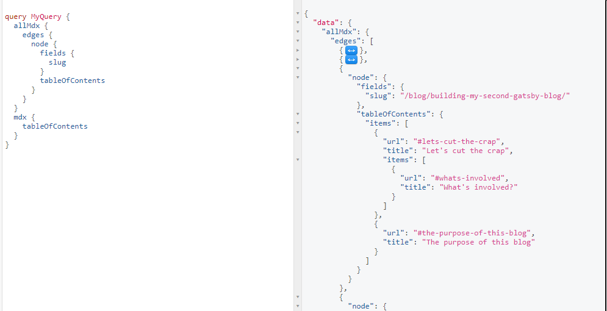

Have you ever had to deal with a kinda data that is nested and so nested that going through it seems like Space made friends with gravity and now the endless fall pulls everyone. Okay. If not, at least you must have written a program that calculates the factorial of a number once before or solved the Tower of Hanoi. Yeah, now you know where I'm headed with this &mdash; recursion.

You definitely have seen or written a recursive program before. Recursion is a function that calls itself within its own body. There is always a control for every properly written recursion, a condition that when finally met, terminates any further call and completes the task of precedent calls on a LIFO (Last in First out) basis emptying the callstack. Several recursions are always seen to take arguments and their subsequent calls take arguments which could be a mutated state of the argument from the initial call that initiated the subseqent calls. Most times the control for the recursion is a logic around the mutated state of the argument passed down, which fixes the Space fall glitch I mentioned earlier and restores Zero G to Space.

```js
function factorial(n) {
  if (n <= 1) {
    return 1
  }
  return n * factorial(n - 1) // highlight-line
}
```

Or a one-liner [Euclidean GCD](https://en.wikipedia.org/wiki/Euclidean_algorithm)

```js
const gcd = (x, y) => y === 0 ? x : gcd(y, x % y)  
```

A point to note is, anything that can be done using a recursion can also be achieved using a normal loop in the [procedural](https://en.wikipedia.org/wiki/Procedural_programming) approach. Recursion is one of the principles associated with [functional programming](https://en.wikipedia.org/wiki/Functional_programming), and has a good composition of logic. Once you get how they work, they should be easy to read and understand.

## React components can be recursive

Enough of recursion jargon, a React component can be recursive. I have had to build a TOC for a blog I built using Gatsby and after I wrote some GraphQL queries, I got a data that was what seemed like nested properties of different levels of headings `h2` through to `h5` or even `h6`.

First, lets query the data we need to build the TOC from. We will do this by opening our Gatsby in-browser GraphiQL IDE and use the explorer to compose the query. Just simply open a new tab and copy and paste `http://localhost:8000/___graphql`

In the GraphiQL IDE we should be able to do something like this:

```graphql
query MyQuery {
  allMdx {
    edges {
      node {
        fields {
          slug
        }
        tableOfContents
      }
    }
  }
  mdx {
    tableOfContents
  }
}
```

The first one will run this query on all your MDX files, which gives a better chance of you, at least, having one with headings.
The second will only run through the last modified or last created MDX file since you didn't provide it with an id of the file to query. In real practice, we will pass an id to it from our `gatsby-node.js` `createPages` `context` through to the `$id` graphql variable.

We should get something with a structure similar to this:



In real practice, in our blog layout component file, we would do an export like this:

```js
export pageQuery = graphql`
  query BlogPostQuery($id: String) {
    mdx(id: { eq: $id }) {
      id
      body
      # Write other queries here as needed
      // highlight-next-line
      tableOfContents # Here is what we need
    }
  }
`
```

## Creating the TOC component

When you look at the result, `tableOfContents` is an object with one property, `items`. The `items` is an array of objects which could contain a sub `items` down and down. This is a tree data structure and we can't tell how many nodes we will reach before finally reaching the last leaf. So lets think of our component the recursive way.

```jsx
function CreateTOC({ items, depth = 0 }) {
  return (
    <>
      <ul style={{ paddingRight: `${depth}rem` }}>
        {items.map(({ url, title, items: nestedItems }, index) => {
          return !nestedItems ? (
            <li key={index}>
              <Link to={url}>{title}</Link>
            </li>
          ) : (
            <React.Fragment key={index}>
              {url && (
                <li>
                  <Link to={url}>{title}</Link>
                </li>
              )}
              <li>
                // highlight-next-line
                <CreateTOC items={nestedItems} depth={depth + 1} />
              </li>
            </React.Fragment>
          )
        })}
      </ul>
    </>
  )
}
```

Here we have it, our recursive TOC component. Whenever we want to render it, we can always pass it an `items` prop of `mdx.tableOfContents.items` we use the `depth` prop to style it to look nested whenever we have a nested item and we increment the value of `depth` passed to the component. Notice that we didn't increment `depth` but we incremented the value of `depth` passed as a prop to the component. To increment `depth` will be to increment and assign: `depth += 1` or `++depth`

```jsx
export default BlogLayout = ({ data }) => {
  const { mdx } = data
  // ...
  return (
    <>
      {/* ... */}
      <CreateTOC items={mdx.tableOfContents.items} />
      {/* ... */}
    </>
  )
}
```

We map through all the items and check if we have any nested items. If we don't have nested items, we return a list item of the current `item`. If we do have a nested item, since we are looking forward, we return two list items one for the current `item` and the other list item will contain a list of the nested items, which is handled by the recursion, so if something similar to what I just explained occurs again, our component already knows how to handle it. You may go ahead to further style things with any  CSS styling approach you are comfortable working with, JSS, CSS-in-JS, SCSS or Vanilla flavour.
