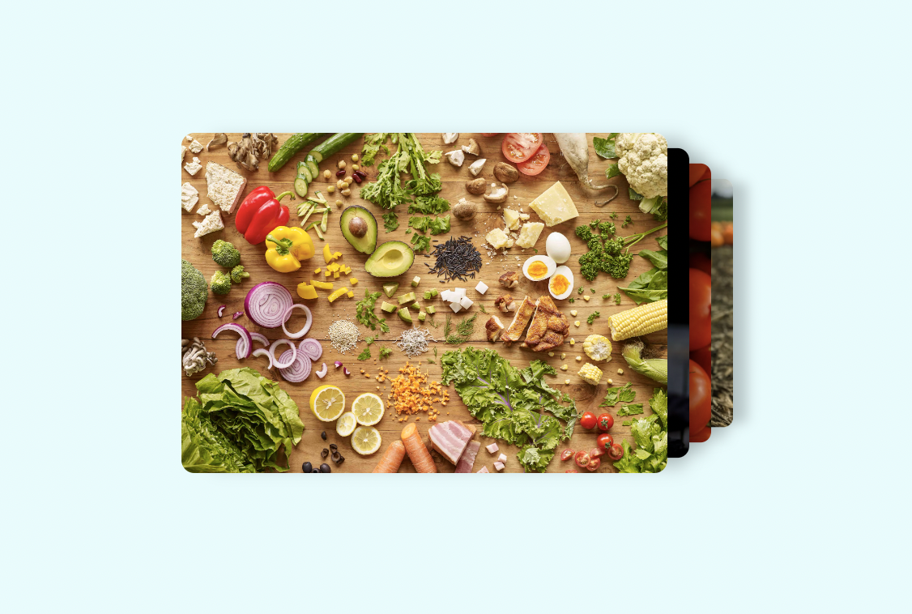
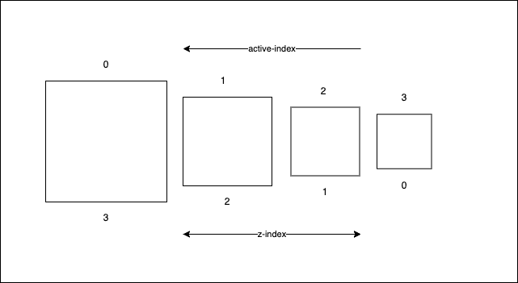
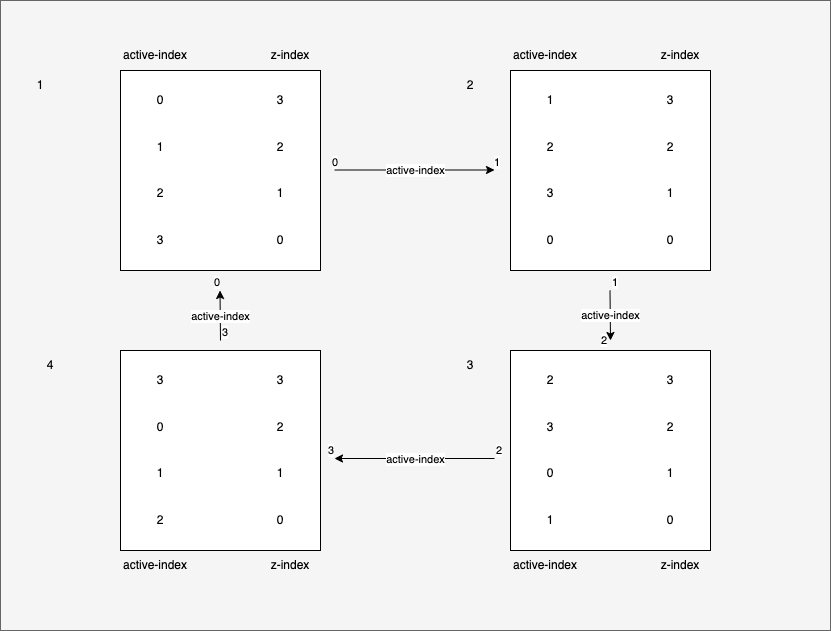

import lollipop from './monkey-lollipop.gif'

Hello folks!

It's been quite a while, and would be pretty rude of me to get into anything without at least saying hello.
I can't really tell what the reason is, why I've been writing a little less often. Hmm—"a little less often"—that's an
understatement!

So what it is really is, I've been playing my hands 'round a couple of stuff and just thought to share one simple yet
interesting part of the things I fiddled with earlier this past week.

I had to sprinkle some images here and there while developing a landing page to help the company I work with hit marketing goals.
It was a quick detour from my major tasks (I'll explain later...not exactly, I'll explain now).

Nice job the designer did, really! So they struck a deal with me to help breathe some life into their work of art.
Everyone wants to see their products alive and well, _everyone_, especially product designers, haha! So I took the deal, and guess what I was to get in return, argh, it's so ridiculous—a stick sweet! Well not one, but two every day till the deal is done.

> The original deal was four everyday, but they said they were concerned about my health, now that's not a bad thing, so two
> it was.

<div
  style={{
    display: 'flex',
    justifyContent: 'center',
    margin: '3rem 0',
  }}
>
  
</div>

## Time to stack these images

I implemented this design bottom-up after developing the basic layout structure, things like, header and footer, etc. Although, I
had no reason why I wanted to take it bottom up, or maybe I did, maybe I knew I had something special for the hero section which
was at the top, immediately after the header, so I saved the best for the last. Thing is, the design never specified how these
images should animate, so I conjured one from the deep of my mind, some kind of Leonardo Da vinci's shit, yunno.

## When there's incentive there's motive

Oh, they actually do mean the same thing!

Well, what I meant to mean by that was: incentives motivate people; but I think you already know that, right?
I didn't do it for the sweet, but because it was fun that I thought I was doing it for the sweets. Oh, seven heavens! I've
completely lost track of time. Okay, okay, okey, now that I'm motivated, let's get into it yuh!

## What we need

First, we need a couple images to make this work. We can go _cop_ some from [Unsplash][unsplash-home]. Thereafter, we create
a normal JavaScript/React project and install a couple dependencies to make it work, but I trust you know how to make that work
so I won't get into that.

```sh
yarn add @chakra-ui/react @emotion/react @emotion/styled @emotion/memoize framer-motion react react-dom

# etc etc
```

Yeah, we'll use chakra, because I don't know how to create CSS files anymore and I just like to write everything inside the component.

https://codesandbox.io/s/10edyi

## Setting up our app

While working on this really, I worked on a Next.js framework, but here I'll try to be as framework agnostic as I can be. We
start by creating our app file, doing a couple imports as neccessary and writing some JSX or TSX. We go ahead to create our index
file and import our app file inside it rendering into the `node#root` in the `index.html` file.

```tsx:title=App.tsx
import { ChakraProvider } from "@chakra-ui/react";
import { StackedImageAnimation } from './StackedImageAnimation';

const App = () => {
  return (
    <ChakraProvider>
      <StackedImageAnimation>
    </ChakraProvider>
  );
};
```

```tsx:title=index.tsx
import { StrictMode } from "react";
import { createRoot } from "react-dom/client";

import App from "./App";

const rootElement = document.getElementById("root");
const root = createRoot(rootElement);

root.render(
  <StrictMode>
    <App />
  </StrictMode>
);
```

Now to the main file that really concerns us, asides these boilerplates. We create our `StakedImageAnimation.tsx` file and get it
started.

```tsx:title=StackedImageAnimation.tsx
import { Box } from "@chakra-ui/react";

export const StackedImageAnimation = () => {
  return (
    <Box>
      <Box></Box>
    </Box>
  );
};
```

## Collecting assets

We'll now head to [Unsplash][unsplash-home] and get some images, about four of them at least. You don't need to download the
images, you can just copy their respective resource links as I did in the code below.

```tsx
const images = [
  'https://images.unsplash.com/photo-1576398289164-c48dc021b4e1?ixlib=rb-4.0.3&ixid=MnwxMjA3fDB8MHxwaG90by1wYWdlfHx8fGVufDB8fHx8&auto=format&fit=crop&w=2148&q=80',
  'https://images.unsplash.com/photo-1499028344343-cd173ffc68a9?ixlib=rb-4.0.3&ixid=MnwxMjA3fDB8MHxwaG90by1wYWdlfHx8fGVufDB8fHx8&auto=format&fit=crop&w=2370&q=80',
  'https://images.unsplash.com/photo-1524593166156-312f362cada0?ixlib=rb-4.0.3&ixid=MnwxMjA3fDB8MHxwaG90by1wYWdlfHx8fGVufDB8fHx8&auto=format&fit=crop&w=2370&q=80',
  'https://images.unsplash.com/photo-1506917728037-b6af01a7d403?ixlib=rb-4.0.3&ixid=MnwxMjA3fDB8MHxwaG90by1wYWdlfHx8fGVufDB8fHx8&auto=format&fit=crop&w=2148&q=80',
]
```

Now, what we want to do is render these images inside our component. You could render them either by using an `` tag
(using chakra's `<Image />` component) or just render them in a `<div />` as a background image (using chakra's `<Box />`). I
personally prefer to render them in a `div` leveraging CSS `background-image` and related properties.

```tsx:title=StackedImageAnimation.tsx
import { Box } from "@chakra-ui/react";

const images = [
  "https://images.unsplash.com/photo-1576398289164-c48dc021b4e1?ixlib=rb-4.0.3&ixid=MnwxMjA3fDB8MHxwaG90by1wYWdlfHx8fGVufDB8fHx8&auto=format&fit=crop&w=2148&q=80",
  "https://images.unsplash.com/photo-1499028344343-cd173ffc68a9?ixlib=rb-4.0.3&ixid=MnwxMjA3fDB8MHxwaG90by1wYWdlfHx8fGVufDB8fHx8&auto=format&fit=crop&w=2370&q=80",
  "https://images.unsplash.com/photo-1524593166156-312f362cada0?ixlib=rb-4.0.3&ixid=MnwxMjA3fDB8MHxwaG90by1wYWdlfHx8fGVufDB8fHx8&auto=format&fit=crop&w=2370&q=80",
  "https://images.unsplash.com/photo-1506917728037-b6af01a7d403?ixlib=rb-4.0.3&ixid=MnwxMjA3fDB8MHxwaG90by1wYWdlfHx8fGVufDB8fHx8&auto=format&fit=crop&w=2148&q=80"
];

export const StackedImageAnimation = () => {
  return (
    <Box>
      {images.map((image, i) => {
        return (
          <Box
            key={image}
            backgroundImage={`url(${image})`}
            backgroundSize="cover"
            backgroundRepeat="no-repeat"
          />
        );
      })}
    </Box>
  );
};
```

If you're quite familiar with this, at this point we are in the code, you should know you won't see any image rendered. The boxes
are there rendered as regular divs in the DOM, but they're empty, and as a result have no definite height or width. If height and
width aren't explicitly set on an element, then they default to `"auto"` for the browser to calculate itself based on what's
contained inside the element.

What we'll do now is set height and width on the containing box, that is the one that wraps the inner boxes and let our inner
boxes inherit their dimensions from this parent box.

Another thing is, we need to take these elements out of the regular layout flow, because even the idea of stacking them atop each
other suggests so. To do this, we give each of the rendered image an absolute position, which helps to position them relative to
their closest relative-positioned ancestor.

```diff-tsx:title=StackedImageAnimation.tsx
export const StackedImageAnimation = () => {
  return (
-     <Box>
+     <Box width={580} height={450} position="relative">
      {images.map((image, i) => {
        return (
          <Box
            key={image}
            backgroundImage={`url(${image})`}
            backgroundSize="cover"
            backgroundRepeat="no-repeat"
+             width="inherit"
+             height="inherit"
+             position="absolute"
+             top={0}
+             right={0}
          />
        );
      })}
    </Box>
  );
};
```

The images are stacked now, but no, they aren't visually stacked yet. To achieve that visual effect, we need to find a
way to shrink down images in the rear and offset them to the right, each successive one farther than the one before it, all in
the same geometric progression. This gives that perspective effect thereby making the images look stacked.



## Understanding the animation flow

Before we can fully understand how the stacking will be achieved, we also need to understand how the swapping will happen. They
are both intertwined.

How could we forget about `z-index` when talking about stacking. To control how these images are stacked we need to manage their
respective z-indices at every point in the animation. But `z-index` isn't the only index we need to control, we also need to
control the active index of the stack. The active index tells us which of these images has just moved to the front of the stack.
We manage the active index—just like a fuel pump counter—using a circular roving technique, making use of modular arithmethic (`%`).

By moving just one of these images from their current position `P` to `Q`, their respective z-indices is recomputed. This happens
when the active index changes, say we have four images, the lower limit is `0` the upper limit is `3`. We must make sure that
when the upper limit is reached, it doesn't tend towards infinity, but returns to its lower limit to start all over again, on and
on in a circular roving manner, rotating from `0` to `3` to `0`. The mathematical formula to make sure of this is:

```txt:title=notepad.txt
(activeIndex + 1) % len(images)
```

```txt:title=notepad.txt
(a + 1) % l = n

where `a` is active index;
      `1` is a constant;
      `l` is the length of images list;
      `n` is next active index

(0 + 1) % 4 = 1 <--
(1 + 1) % 4 = 2   |
(2 + 1) % 4 = 3   |
(3 + 1) % 4 = 0 <--
```



Now that we know how to manage our active index let's go ahead and add that to the code. Our active index only changes every five
seconds, and we manage that using a `setInterval` inside a `useEffect` hook.

```diff-tsx:title=StackedImageAnimation.tsx
+ import { useEffect, useMemo, useRef, useState } from 'react';

export const StackedImageAnimation = () => {
+   const [activeIndex, setActiveIndex] = useState(0);
+   const timer = useRef<NodeJS.Timeout | number>(-1);
+   const size = useMemo(() => images.length, []);
+
+   useEffect(() => {
+       timer.current = setInterval(
+         () => setActiveIndex((cur) => (cur + 1) % size),
+         5000
+       );
+
+      return () => clearInterval(timer.current as number);
+   }, [size]);
+
  return (...);
};
```



As observed in the figure above, we could map indices to z-indices, and notice that the z-indices aren't changing, it's only the
active indices that keep rotating. When the rotation occurs the index at the top of the stack (active index) assumes or inherits
the z-index at that position in the map for as long as the active index hasn't changed (in our case for 5000 milliseconds).

The codeblock that follows is an implementation of the above image which specifies how the active index rotates around the z-index

```tsx
const map = useMemo(() => {
  const map = new Map<number, number>()
  const len = images.length
  let i = len

  if (len < activeIndex || activeIndex < 0)
    throw new Error('Invalid index set as active index')

  while (i > 0) {
    // highlight-next-line
    map.set((activeIndex + len - i) % len, --i)
  }

  return map
}, [activeIndex])
```

Now this map here, which computes every single time our `activeIndex` changes (every 5000 milliseconds) is the solution to most
of our problems.

Hopefully, the part that throws an exception would never be reached as long as all goes as planned. So it's redundant, except
that it communicates intent to whoever is reading it, as to what would be an unexpected behaviour for our program.

<Callout type="info">
  It could be quite difficult to make sense of the line of code inside the while
  loop. It's as good as saying <code>(activeIndex + i) % len</code> if{' '}
  <code>i</code> had started from <code>0</code> and not the length of the
  images list <code>4</code>. So when <code>i = 4; len - i = 0</code>, and since
  <code>i</code> keeps decreasing every step of the loop, it would just seem like{' '}
  <code>i</code> increases from <code>0-3</code>
</Callout>

## Shrinking and offsetting rear images progressively

Now that we've established the framework for our animation, majority of what seemed difficult to do are by a great deal easier now.
One way I can think of for shrinking down rear images is to transform them using the CSS `scale` function. For offseting, there
are two possible ways I can think of: one of which is also to transform using CSS `translate` function; two, is to make use of the
CSS `right` property since our images are absolute-positioned to their relative-positioned parent box.

Now, some other deductions we can make is that the scale and the offset are a function of the z-index. Since the image with the
highest z-index (top of the stack) needs no shrinking and offsetting, and the image with the least z-index (bottom of the stack)
needs the most shrinking and offsetting.

The dependent variables here are the scale and offset factor, while the independent variable is the z-index which we can always
retrieve from the map for each index of the images.

We can pick a constant, multiple of which will make the cumulative factor by which our images would be scaled down and offset.
I prefer to pick something small, say `0.075` or `0.09` maybe.

```diff-tsx:title=StackedImageAnimation.tsx
<Box width={580} height={450} position="relative">
  {images.map((image, i) => {
+     const factor = size - 1 - map.get(i)!;
+
    return (
      <Box
        key={image}
        backgroundImage={`url(${image})`}
        backgroundSize="cover"
        backgroundRepeat="no-repeat"
        width="inherit"
        height="inherit"
        position="absolute"
        top={0}
-         right={0}
+         right={0 - 0.075 * factor * 580}
+         transform={`scale(${1 - 0.075 * factor})`}
      />
    )
  })}
</Box>
```

<Callout type="info">
  <code>size - 1</code> in the code above, when computing our factor is just a
  reminder that our indices goes from <code>0-3</code> but length of our list
  goes from <code>1-4</code>
</Callout>

### What goes into factor?

So this is the deal: take a look at the figure image that lays out the active index to z-index mapping. Say our active index is
`2` and `i` is also currently `2`, then to find the appropraite z-index for `images[2]`, we'll do a `map.get(i)` value of which
should be `3`. Every time our active index changes, all indices are re-rotated around the z-index. As I said earlier, the scale
and offset are a function of the z-index. `images[2]` is at the top of the stack, so it needs the least shrinking and offsetting;
`images[1]` is at the bottom of the stack, so it needs the most shrinking and offsetting. In other words, scale and offset are
inversely related to the z-index. At active index `2` the z-index is up to `3`; to get the correct factor we do a
`size - 1 - map.get(i)`, where `size = 4`, giving a final result of `0`.

When `i` was at `1`, `map.get(i)` gives a z-index of `0`. Running that through our function again, `size - 1 - map.get(i)` will
give `3`.

We take this computed factor and multiply with our base diminishing factor of `0.075` to get multiples of it progressively down
the loop.

### Where does `580` come from?

`scale` acts on the size of an object (`x`, `y`) or (`width`, `height`). If we'll be calculating the offset across the x-axis (`right`), then we must know what proportion of the initial size (`width`) of our object (in this case element) it was diminished by. We take out that same proportion to the right to make up for the shrink in the offset. There and there we have it, our images looking stacked.

## Where do we go from here?

Now that we have our images stacked and swapping every five seconds we rotate the active index in our `useEffect` hook, we need to make this animation feel more natural. Some transitioning would do the trick actually, and we can go ahead and achieve that using the CSS `transition` property.

Something that we are forgetting, and you have failed to remind me is setting our `z-index`.

```diff-tsx:title=StackedImageAnimation.tsx
<Box width={580} height={450} position="relative">
  {images.map((image, i) => {
    const factor = size - 1 - map.get(i)!;
+     const isPreviousActiveIndex = (activeIndex + size - 1) % size === i;

    return (
      <Box
        key={image}
        backgroundImage={`url(${image})`}
        backgroundSize="cover"
        backgroundRepeat="no-repeat"
        width="inherit"
        height="inherit"
        position="absolute"
        top={0}
        right={0 - 0.075 * factor * 580}
        transform={`scale(${1 - 0.075 * factor})`}
+         zIndex={map.get(i)}
+         transition={"z-index 0.6s ease, transform 0.6s ease".concat(
+             isPreviousActiveIndex ? ", right 0.3s ease" : ""
+         )}
      />
    )
  })}
</Box>
```

> Hmm...I thought we only mentioned `z-index` and `transition`.
> Why are we doing a `isPreviousActiveIndex` check?

Good question!

We want a right transition only for the image that was formerly at the top of the stack which is now getting swapped out to the
bottom just for the one right behind it to come to the top. The others don't need that right transition, they will just grow bigger and move quite inwards from the right. What really matters is how they grow bigger, but for the one moving to the bottom, it starts with moving outwards to the right and then growing smaller so we want both transitions for it.

## Putting the pieces together

```tsx:title=StackedImageAnimation.tsx
import { Box } from "@chakra-ui/react";
import { useEffect, useMemo, useRef, useState } from 'react';

const images = [
  "https://images.unsplash.com/photo-1576398289164-c48dc021b4e1?ixlib=rb-4.0.3&ixid=MnwxMjA3fDB8MHxwaG90by1wYWdlfHx8fGVufDB8fHx8&auto=format&fit=crop&w=2148&q=80",
  "https://images.unsplash.com/photo-1499028344343-cd173ffc68a9?ixlib=rb-4.0.3&ixid=MnwxMjA3fDB8MHxwaG90by1wYWdlfHx8fGVufDB8fHx8&auto=format&fit=crop&w=2370&q=80",
  "https://images.unsplash.com/photo-1524593166156-312f362cada0?ixlib=rb-4.0.3&ixid=MnwxMjA3fDB8MHxwaG90by1wYWdlfHx8fGVufDB8fHx8&auto=format&fit=crop&w=2370&q=80",
  "https://images.unsplash.com/photo-1506917728037-b6af01a7d403?ixlib=rb-4.0.3&ixid=MnwxMjA3fDB8MHxwaG90by1wYWdlfHx8fGVufDB8fHx8&auto=format&fit=crop&w=2148&q=80"
];

export const StackedImageAnimation = () => {
  const [activeIndex, setActiveIndex] = useState(0);
  const timer = useRef<NodeJS.Timeout | number>(-1);
  const size = useMemo(() => images.length, []);

  useEffect(() => {
    timer.current = setInterval(
      () => setActiveIndex((cur) => (cur + 1) % size),
      5000
    );

    return () => clearInterval(timer.current as number);
  }, [size]);

  const map = useMemo(() => {
    const map = new Map<number, number>();
    const len = images.length;
    let i = len;

    if (len < activeIndex || activeIndex < 0)
      throw new Error('Invalid index set as active index');

    while (i > 0) {
      map.set((activeIndex + len - i) % len, --i);
    }

    return map;
  }, [activeIndex]);

  return (
    <Box width={580} height={450} position="relative">
      {images.map((image, i) => {
        const factor = size - 1 - map.get(i)!;
        const isPreviousActiveIndex = (activeIndex + size - 1) % size === i;

        return (
          <Box
            key={image}
            backgroundImage={`url(${image})`}
            backgroundSize="cover"
            backgroundRepeat="no-repeat"
            width="inherit"
            height="inherit"
            position="absolute"
            top={0}
            right={0 - 0.075 * factor * 580}
            transform={`scale(${1 - 0.075 * factor})`}
            zIndex={map.get(i)}
            transition={"z-index 0.6s ease, transform 0.6s ease".concat(
                isPreviousActiveIndex ? ", right 0.3s ease" : ""
            )}
          />
        );
      })}
    </Box>
  );
};
```

Don't forget we have the [codesandbox above there](#what-we-need) for you to take a look and fiddle with as you think is interesting.

Don't forget to share also!

Thank you and have a wonderful week!

[unsplash-home]: https://unsplash.com
