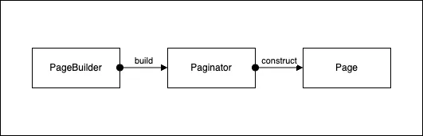

Whether it's offset pagination or cursor pagination, that's not what this is about. But cursor
pagination can be quite challenging. Mostly, pagination doesn't always stop at that. You have to
consider other features like sorting, and filtering, too. For quite a while now, I've had a stable
implementation for cursor pagination which I designed bottom up and I can remember before figuring
out how to go about cursor pagination the correct way, I searched the internet and found it
difficult to find anything of use, so I decided to share mine in a blog post, which, lucky for you,
is this blog post you are reading.

My first attempt at implementing cursor pagination was some years ago when I was working on some
GraphQL API. I had to read the [Relay specs][relay-specs] to get a good knowledge of the dos and
don'ts. All seemed to work fine then, but a few months after the API had been deployed to
production, I noticed a way of combining queries which would lead to a very haphazard result
attributed to an implementation that misconceived the "Relay spec" I followed while developing it.
Well, the implementation didn't misconceive it, I did, and that reflected in my implementation. I've
reworked it ever since and have had a stable implementation that works well.

There are three essential components to this design. There's a `PageBuilder` which is the builder
class for the page of records we are returning to the client, a `Paginator` which is the mediator
between the page builder and the page itself, then the `Page` which is got after the paginator has
composed instructions on how to retrieve the page.



The `PageBuilder` follows the [builder pattern][builder-pattern] while using the `Paginator` to
build a page of database records to return to the client.

I think it would make sense if I defined certain things as regards this article, and as you may see
them on the Relay spec, which could be specific to GraphQL, but I'll be borrowing a few vocabularies
from there, i.e., using their jargon to explain my jargon.

| Term   | Definition                                                                                                    |
| ------ | ------------------------------------------------------------------------------------------------------------- |
| Page   | a long scroll of records or objects, and can have as many edges as is read into it                            |
| Edge   | holds a specific record or object along the page                                                              |
| Cursor | an opaque string, mostly Base64 encoded, that uniquely identifies an edge across pages for the entire records |
| Vertex | the point where two edges from two different pages meet                                                       |

We go ahead and lay down a scaffold of the essential classes. First, we define two generics, of
which one is to take the concrete SQLAlchemy model class, named `ModelT`; while the other takes a
concrete Pydantic model class, which we'll use for serializing the criteria we filter by, named
`FilterT`. Later on, we'll "bound" these generic type vars to their expected, respective base
classes as this helps guide what concrete type should be allowed. `ModelT` would be bound to an
SQLAlchemy `DeclarativeBase` class, while `FilterT` would be bound to a Pydantic `BaseModel` class.

```python
from typing import Any, Callable, Generic, Self, TypeVar, cast, overload


ModelT = TypeVar("ModelT")
FilterT = TypeVar("FilterT")


class Page(Generic[ModelT]):
    pass

class Paginator(Generic[ModelT, FilterT]):
    pass

class PageBuilder(Generic[ModelT, FilterT]):
    pass
```

One at a time we'll fill up these scaffolds with something more solid, like blocks of code. I
suggest we start bottom up, and that takes us to the builder. I mean, you can only build anything
bottom-up, no?

```python
class PageBuilder(Generic[ModelT, FilterT]):
    def __init__(self):
        """A builder class for building a page of edges (or page objects) of various models"""

        self._paginator: Paginator[ModelT, FilterT]
        self._bottom_cursor: str
        self._top_cursor: str
        self._filter: FilterT
        self._sorts: list[str]
```

We keep a paginator instance within our builder class, a reference to the top and bottom cursors of
the previous page if this is an attempt to build a subsequent page, the filter criteria, and a list
of string fields to sort records in the database by, concatenated with the sort order and delimited
by a colon (`"field:order"`). We can view the top and bottom cursors of a page as pointing to
_vertices_ where two edges from conjoining pages meet.

Next is a setup method on the page builder. The `setup` method takes the SQLAlchemy session to query
with and the model to query on, then creates an instance of `Paginator` with them.

```python
from uuid import UUID

from sqlalchemy.orm import Query, Session
from sqlalchemy.orm.query import RowReturningQuery


class Paginator(Generic[ModelT, FilterT]):
    def __init__(self, session: Session, model: type[ModelT]):
        self.model = model
        self.session = session

        self._query: Query[ModelT] = session.query(self.model)
        self._object_count_query: RowReturningQuery[tuple[UUID]] = session.query(self.model.id)


class PageBuilder(Generic[ModelT, FilterT]):
    def setup(self, session: Session, model: type[ModelT]):
        """Set up the page builder and get it ready for taking instructions
        or steps on how to build the page.

        :param session: The database session to use to query for page objects
        :param model: The model to execute the query on
        """

        self._paginator = Paginator[ModelT, FilterT](session, model)

        return self
```

We've got an extra responsibility to ensure a session and a model is set on the paginator before
doing pretty much anything. Since `PageBuilder` is mostly the public interface to work with a
paginator, we should do this check on the page builder rather than the paginator itself. We can hook
into the object internals, by creating a checkpoint using one of Python's magic or dunder methods,
`__getattribute__`.

```python
class PageBuilder(Generic[ModelT, FilterT]):
    def __getattribute__(self, __name: str) -> Any:
        if __name == "setup":
            return super().__getattribute__(__name)

        if not super().__getattribute__("_paginator"):
            raise AttributeError("session has not been set, did you forget to call setup on the PageBuilder?")

        return super().__getattribute__(__name)
```

The page builder has a few operations some of which are entirely necessary to build a page while
others are as needed. Using the page builder, we can navigate to an edge after a specific cursor,
and if you remember correctly a cursor uniquely identifies another edge in the "grand page".

> Grand page...something I should've mentioned earlier is that we could model the entire record in
> the database as one grand page, like a very long scroll of data. We try to fold this long scroll
> into smaller individual pages and send it over the network as requested.


_Update the glossary with "grand page"!_

I was speaking about operations earlier: other operations, still, are navigating to an edge before a
specific cursor, skimming through the page to filter out edges we do not want to appear on a
page&mdash;just like an editor would a book&mdash;sorting the edges on a page to ensure it's
orderly.

To write all that in code:

```python
class PageBuilder(Generic[ModelT, FilterT]):
    def go_to_edge_after(self, cursor: str | None) -> Self:
        """Take the builder to an edge after a specific edge marked
        by a cursor

        :param cursor: The cursor that marks the edge to go to after which \
            are the desired edges we need to build our page. \
            If None, this instruction is ignored.
        """

        if cursor is not None:
            self._bottom_cursor = cursor
        return self

    def go_to_edge_before(self, cursor: str | None) -> Self:
        """Take the builder to an edge before a specific edge marked
        by a cursor.

        :param cursor: The cursor that marks the edge to go to, before which \
            are the desired edges we need to build our page. \
            If None, this instruction is ignored.
        """

        if cursor is not None:
            self._top_cursor = cursor
        return self

    def skim_through(self, filter_: FilterT) -> Self:
        """Skim through edges (conveniently, filter records) using a set of filter
        criteria, and find the records that fit our filter condition, then use
        these records to build a desired page

        :param filter_: The set of filters to use to find desired records
        """
        self._filter = filter_
        return self

    def sort(self, sorts: list[str]) -> Self:
        """Sort the edges in the desired way specified by a list of sort criteria.
        The edges will appear ordered by the given criteria on the eventual page built

        :param sorts: A list of sort criteria to use to order edges on the page
        """

        self._sorts = sorts
        return self
```

Next up is building the page, and that takes us on a deep dive into the paginator. The paginator
does the heavy lifting, builds the query for navigating through edges, skimming through and
filtering, sorting, and checking to see if there are more edges to be retrieved that can be used to
build subsequent pages for subsequent requests. Yet the paginator executes no query, it only
constructs a page that can be read at the service level, and only then are the queries executed.

```python
class PageBuilder(Generic[ModelT, FilterT]):
    def build(self) -> Page[ModelT]:
        if hasattr(self, "_bottom_cursor") and getattr(self, "_bottom_cursor") is not None:
            return self._paginator.get_first_after(
                cursor=self._bottom_cursor,
                filter_=self._filter,
                sorts=self._sorts,
            )
        elif hasattr(self, "_top_cursor") and getattr(self, "_top_cursor") is not None:
            return self._paginator.get_last_before(
                cursor=self._top_cursor,
                filter_=self._filter,
                sorts=self._sorts,
            )
        return self._paginator.get_initial(filter_=self._filter, sorts=self._sorts)
```

As you can see, there are three main entry points for the page builder into the paginator:

- `get_first_after` &ndash; retrieves the first `x` records after a specific cursor
- `get_last_before` &ndash; retrieves the last `x` records before a specific cursor
- `get_initial` &ndash; retrieves `x` records in their in situ sequence

But before we get into all this, what is a `Page` going to be like? We haven't structured that class
much, so here's something to work with:

```python
class Page(Generic[ModelT]):
    def __init__(
        self,
        title: str = "Untitled",
        *,
        main_query: Query[ModelT],
        object_count_query: RowReturningQuery[tuple[UUID]],
        has_more_query_factory: Callable[[str, str], RowReturningQuery[tuple[int, bool, bool]]],
    ):
        """A representation of a page of specific objects of a model, `ModelT`"""
        self.title = title
        self.read_size: int
        self.total_size: int

        self._main_query = main_query
        self._object_count_query = object_count_query
        self._has_more_query_factory = has_more_query_factory
        self._cursor_isset = False
        self._has_more_have_been_queried = False
        self._top_cursor: str | None
        self._bottom_cursor: str | None
        self._has_prev: bool
        self._has_next: bool
```

The page is initialized with two types of queries and a factory function that generates a query when
called, and also takes an optional title parameter which can be useful for debugging purposes. The
main query which returns the objects or rows that should be contained in the page when executed, the
object-count query which evaluates the maximum number of objects or rows that can be contained in a
page, i.e., all the records in the database that match every necessary criterion as "filter". The
has-more query factory which is a factory function such that when provided with the top and bottom
cursors of the current page can generate a query which when executed can be used to determine if
there are more records before and/or after the records or objects or rows on the current page.

```python
class Paginator(Generic[ModelT, FilterT]):
    def get_first_after(
        self,
        *,
        cursor: str,
        filter_: FilterT | None = None,
        sorts: list[str] = [],
    ):
        # highlight-next-line
        edges_after_query = self.get_edges_after_query(cursor)
        self._query = self._query.filter(self.model.id.in_(edges_after_query))

        if filter_ is not None:
            # highlight-start
            self.skim_through(filter_=filter_)
            self._object_count_query = self.skim_through(
                filter_=filter_,
                query=self._object_count_query,
            )
            # highlight-end

        if sorts and len(sorts) > 0:
            # highlight-next-line
            self._query = self.sort(sorts, self._query)

        return Page[ModelT](
            self.model.__name__,
            main_query=self._query,
            object_count_query=self._object_count_query,
            # highlight-start
            has_more_query_factory=lambda x, v: self.get_has_more_edges_query(
                top_cursor=x, bottom_cursor=v, filter_=filter_
            ),
            # highlight-end
        )

    def get_last_before(
        self,
        *,
        cursor: str,
        filter_: FilterT | None = None,
        sorts: list[str] = [],
    ):
        # highlight-next-line
        edges_before_query = self.get_edges_before_query(cursor)
        self._query = self._query.filter(self.model.id.in_(edges_before_query))

        if filter_ is not None:
            self.skim_through(filter_=filter_)
            self._object_count_query = self.skim_through(
                filter_=filter_,
                query=self._object_count_query,
            )

        if sorts and len(sorts) > 0:
            self.sort(sorts)

        return Page[ModelT](
            self.model.__name__,
            main_query=self._query,
            object_count_query=self._object_count_query,
            has_more_query_factory=lambda x, v: self.get_has_more_edges_query(
                top_cursor=x, bottom_cursor=v, filter_=filter_
            ),
        )

    def get_initial(
        self,
        *,
        filter_: FilterT | None = None,
        sorts: list[str] = [],
    ):
        if filter_ is not None:
            self.skim_through(filter_=filter_)
            self._object_count_query = self.skim_through(
                filter_=filter_,
                query=self._object_count_query,
            )

        if sorts and len(sorts) > 0:
            self.sort(sorts)

        return Page[ModelT](
            self.model.__name__,
            main_query=self._query,
            object_count_query=self._object_count_query,
            has_more_query_factory=lambda x, v: self.get_has_more_edges_query(
                top_cursor=x,
                bottom_cursor=v,
                filter_=filter_,
            ),
        )
```

We have a couple of methods we haven't defined but made reference to:

- `get_edges_after_query` &ndash; generate a query that can be used as a subquery that retrieves
  records existing after another record marked by a cursor
- `get_edges_before_query` &ndash; generate a query that can be used as a subquery which retrieves
  records existing before another record marked by a cursor
- `skim_through` &ndash; composes the filter query
- `sort` &ndash; composes the sort query
- `get_has_more_edges_query` &ndash; generate a query that can be used to check that more records
  matching the current conditions, as "filter", exists.

```python
import base64


class Paginator(Generic[ModelT, FilterT]):
    def get_edges_after_query(self, cursor: str):
        cursor_value = base64.urlsafe_b64decode(cursor).decode()
        query = self.session.query(self.model.id).filter(self.model.created_at > cursor_value)

        return query

    def get_edges_before_query(self, cursor: str):
        cursor_value = base64.urlsafe_b64decode(cursor).decode()
        query = self.session.query(self.model.id).filter(self.model.created_at < cursor_value)

        return query
```

The `skim_through` method is an overloaded method that does simple filtering of records on the
database. This filtering is as basic as using SQL `ILIKE` pattern matching. It's complex to compose
a one-size-fits-all filtering technique for an HTTP **GET** request. While it is achievable, it
presents a lot of complexities that make me think it's not worth it. In my opinion, it's better to have
a dedicated HTTP **POST** endpoint for complex filtering and searching, where you can compose
complex filters using operators like `eq`, `gte`, etc, sent in a request body rather than in a query
string in the URI which has a (fairly large, but not unsurpassable) character limit.

```python
from sqlalchemy import BinaryExpression, ColumnElement, String, and_
from sqlalchemy import cast as sa_cast
from sqlalchemy import inspect as sa_inspect
from sqlalchemy import literal, or_
from sqlalchemy.sql.expression import asc, desc


RowT = TypeVar("RowT", bound=tuple[Any, ...])
SkimThroughQueryT = TypeVar("SkimThroughQueryT", bound=Query[Any])


class Paginator(Generic[ModelT, FilterT]):
    @overload
    def skim_through(self, *, filter_: FilterT) -> None:
        """Skim through records using a couple of filter criteria set in `filter_`

        Method has side effects as it does mutate its object state (internally),
        rather than just returning a new, modified, query.

        Implicitly sets `self._query` which impacts the eventual query generated
        """
        ...

    @overload
    def skim_through(self, *, filter_: FilterT, query: Query[ModelT]) -> Query[ModelT]:
        """Skim through records using a couple of filter criteria set in `filter`

        Method has no side effects as it doesn't mutate it's object state
        (internal or external), and just returns a new, modified, query from
        the query it was given directly.
        """
        ...

    @overload
    def skim_through(
        self,
        *,
        filter_: FilterT,
        query: RowReturningQuery[RowT],
    ) -> RowReturningQuery[RowT]:
        """Skim through records using a couple of filter criteria set in `filter_`

        Method has no side effects as it doesn't mutate it's object state
        (internal or external), and just returns a new, modified, query from
        the query it was given directly.

        This is different as it receives a query that queries specific rows on
        its model rather than the entire model.
        """
        ...

    def skim_through(
        self,
        *,
        filter_: FilterT,
        query: SkimThroughQueryT | None = None,
    ) -> SkimThroughQueryT | None:
        """Implementation"""

        query_is_none = query is None
        q = self._query if query_is_none else query

        conditions: list[ColumnElement[bool]] = []

        for attr in filter_.model_fields_set:
            values: Any | list[Any] = filter_.model_dump(exclude_defaults=True).get(attr, [])

            if attr in sa_inspect(self.model).columns.keys():
                # highlight-next-line
                column = sa_cast(self.model.__dict__[attr], String)
                mapper: Callable[[str], BinaryExpression[bool]] = lambda v: column.ilike(f"%{v}%")
                condition = (
                    map(mapper, values)
                    if type(values) is list[Any]
                    else map(mapper, [cast(str, values)])
                )
                conditions.append(or_(*condition))
            else:
                print(f"Attr not found in database model, attr='{attr}', model={self.model}")
        q = q.filter(and_(*conditions))

        # If no query was given, mutate the object's internal query and return None to make sure
        # the API consumer knows the difference.
        if query_is_none:
            self._query = q
            return None
        return cast(SkimThroughQueryT, q)
```

For each field to filter by we inspect the SQLAlchemy model to check that the field exists in the
database and compose several expressions conjoined by an `or` operator (for a list of values) or a
single expression (for a single value) for each field, and eventually conjoined using an `and`
operator.

<Callout type="info">
  It's important to cast the column to a string type so we can use the SQL `ILIKE` operator on the
  column.
</Callout>

Sorting is straightforward. Overloaded also, just like `skim_through`.

```python
class Paginator(Generic[ModelT, FilterT]):
    @overload
    def sort(self, sorts: list[str]) -> None:
        """Sort records using a couple of sort criteria set in `sorts`

        Method has side effects as it does mutate its object state (internally),
        rather than just returning a new, modified, query.

        Implicitly sets `self._query` which impacts the eventual query generated
        """
        ...

    @overload
    def sort(self, sorts: list[str], query: Query[ModelT]) -> Query[ModelT]:
        """Sort records using a couple of sort criteria set in `sorts`

        Method has no side effects as it doesn't mutate it's object state
        (internal or external), and just returns a new, modified, query from
        the query it was given directly.
        """
        ...

    def sort(self, sorts: list[str], query: Query[ModelT] | None = None):
        """Implementation"""

        query_is_none = query is None
        q = self._query if query_is_none else query

        for sort in sorts:
            try:
                sort_col, sort_order = sort.split(":")

                if sort_col in sa_inspect(self.model).columns.keys():
                    column = self.model.__dict__[sort_col]
                    xpression = desc(column) if sort_order.lower() == "desc" else asc(column)
                    q = q.order_by(xpression)
            except ValueError:
                if sort in sa_inspect(self.model).columns.keys():
                    q = q.order_by(asc(self.model.__dict__[sort]))
                else:
                    print(f"Sort parameter param='{sort}' doesn't exist")
        # If no query was given, mutate the object's internal query and return None to make sure
        # the API consumer knows the difference.
        if query_is_none:
            self._query = q
            return None
        return q
```

Looking at the code above: it becomes evident that sorting is specified using a `column:order`
syntax and also possibly, a `column` syntax which is where the try-except `ValueError` comes in, and
an ascending order is assumed.

On to the `get_has_more_edges_query`. This requires a little understanding of some raw SQL queries
to understand the ORM querying. The has-more query checks pre- and post-positions for records, i.e.,
previous and next records as `has_prev` and `has_next` respectively, all in one query and each makes
use of two subqueries.

```SQL
SELECT
    1 AS "id",
    (
        SELECT EXISTS (
            SELECT 1
            FROM "user" "user"
            WHERE ("user"."created_at" < %(top_cursor)s)
            -- Plus additional filters
        )
    ) AS "has_prev",
    (
        SELECT EXISTS (
            SELECT 1
            FROM "user" "user"
            WHERE ("user"."created_at" > %(bottom_cursor)s)
            -- Plus additional filters
        )
    ) AS "has_next";
```

This is the typical query we are trying to model using an ORM. It's quite straightforward to use
with SQLAlchemy ORM, but I'm not so sure it's as straightforward with other ORMs such as TypeORM.
Might require some hack or directly writing and executing the raw query (a hack, speaking from
experience, works).

```python
class Paginator(Generic[ModelT, FilterT]):
    def get_has_more_edges_query(
        self,
        *,
        top_cursor: str,
        bottom_cursor: str,
        filter_: FilterT | None = None,
    ) -> RowReturningQuery[tuple[int, bool, bool]]:
        """
        The query should produce a `tuple[int, bool, bool]` when executed and each field is
        correctly positioned in the tuple as it occurs in the query.

        For example::

            id, has_prev, has_next = tuple[int, bool, bool]
        """

        top_cursor_value = base64.urlsafe_b64decode(top_cursor).decode()
        bottom_cursor_value = base64.urlsafe_b64decode(bottom_cursor).decode()

        has_prev_subquery = self.session.query(self.model).filter(
            self.model.created_at < top_cursor_value
        )

        has_next_subquery = self.session.query(self.model).filter(
            self.model.created_at > bottom_cursor_value
        )

        if filter_ is not None:
            has_prev_subquery = self.skim_through(filter_=filter_, query=has_prev_subquery)
            has_next_subquery = self.skim_through(filter_=filter_, query=has_next_subquery)

        outer_has_prev_subquery = self.session.query(has_prev_subquery.exists())
        outer_has_next_subquery = self.session.query(has_next_subquery.exists())

        query = self.session.query(
            literal(1).label("id"),
            outer_has_prev_subquery.label("has_prev"),
            outer_has_next_subquery.label("has_next"),
        )

        return query
```

All contracts fulfilled! We've defined and implemented every detail needed from the page builder to
the paginator. Now one last stop before we arrive home: a page, mi amor!

A page is what we've been trying to arrive at all along. It's the sole purpose of our page-builder.
What do we need a page to do? Most importantly a page should be readable! We also should be able to
know if a page has a previous page and/or a next page, access its cursors for easy referencing, tell
the size of the page after "folding", and tell the total size of the "grand page" after filtering
but before folding. "Folding" occurs just when the page is being read, using an SQL `LIMIT` clause.

```python
class Page(Generic[ModelT]):
    def cursors(self) -> tuple[str | None, str | None]:
        """Retrieve the cursors to the top and bottom vertexes of the edges
        read from a page.

        Note: this method should only be called after the page has been read,
        `page.read(size)`, and not before

        :returns: a tuple consisting of the top and bottom cursor
            `(top_cursor, bottom_cursor)`
        """

        # highlight-next-line
        self._check_cursor_isset()
        return (self._top_cursor, self._bottom_cursor)

    def has_more(self):
        """Check if there are more edges before and after the top and bottom vertexes
        of the edges read from a page.

        Note: this method should only be called after the page has been read,
        `page.read(size)`, and not before.

        Alternatively, to check if a page has previous, `page.has_previous()`, and to
        check if it has next, `page.has_next()`

        :returns: a tuple consisting of the "has previous" and "has next" status
            `(has_prev, has_next)`
        """

        self._check_cursor_isset()

        # check if the "has more" query has already been executed
        if self._has_more_have_been_queried:
            return (self._has_prev, self._has_next)

        # if self._top_cursor is None then self._bottom_cursor will also be None
        # Which means the result set of read pages was empty.
        if self._top_cursor is None:
            return (False, False)

        # fmt: off
        assert (self._bottom_cursor is not None), \
              "_top_cursor is supposed to be mutually inclusive with _bottom_cursor"
        # fmt: on

        has_more_query = self._has_more_query_factory(self._top_cursor, self._bottom_cursor)

        row = has_more_query.one()
        result = row.tuple()
        as_dict = row._asdict()  # type: ignore

        print(f"Does this {self.title} page have a previous page? {as_dict.get('has_prev')}")
        print(f"Does this {self.title} page have a next page? {as_dict.get('has_next')}")

        _, self._has_prev, self._has_next = result

        self._has_more_have_been_queried = True

        return (self._has_prev, self._has_next)

    def has_previous(self):
        """Check if a page has previous"""
        return self.has_more()[0]

    def has_next(self):
        """Check if a page has next"""
        return self.has_more()[1]

    def read(self, size: int):
        """Read a certain amount, `size`, of edges from a grand page

        :param size: The size of objects or edges desired on a page
        """
        # counts total rows the main query is capable of producing
        total_size = self._object_count_query.count()

        self.total_size = total_size
        self.read_size = size

        print(f"Reading {size} of {total_size} edges from a {self.title} page")

        read_pages = self._main_query.limit(size).all()

        # highlight-next-line
        self._register_cursors_from_read_pages(read_pages)

        return read_pages
```

Here again, we have references to some undefined methods. The `_register_cursors_from_read_pages`
method takes the read pages, restores their chronological order, discarding whatever sorting
criterion had been previously applied on them at the database level, then picks the edge at the
start and end of the list, termed vertices, because it's assumed that both ends are where the
folding occurs separating this page from the previous page and the next page. It goes on to generate
cursors from both ends and register them on the page for future use.

```python
from datetime import datetime


iso_format_date: Callable[[datetime], str] = lambda x: x.strftime("%Y-%m-%dT%H:%M:%S.%fZ")

class Page(Generic[ModelT]):
    def _check_cursor_isset(self):
        if not self._cursor_isset:
            raise AttributeError("cursors have not been set yet, you should read the page first")

    def _register_cursors_from_read_pages(self, read_pages: list[ModelT]):
        read_pages_sorted_by_cursor_key = sorted(read_pages, key=lambda v: v.created_at)

        # If results length is zero, all cursors are None
        if len(read_pages_sorted_by_cursor_key) == 0:
            self._top_cursor = None
            self._bottom_cursor = None
            self._cursor_isset = True
            return
        top_vertex = read_pages_sorted_by_cursor_key[0]
        bottom_vertex = read_pages_sorted_by_cursor_key[-1]

        # If the length of the results is one, all cursors are not None but the same
        if len(read_pages_sorted_by_cursor_key) == 1:
            # The encoded cursor of a point referencing both the top and bottom vertex of the page
            vertex_ref_enc = iso_format_date(top_vertex.created_at).encode()
            self._top_cursor = base64.urlsafe_b64encode(vertex_ref_enc).decode()
            self._bottom_cursor = self._top_cursor
        else:
            # The encoded cursor of a point referencing the top vertex of the page
            top_vertex_ref_enc = iso_format_date(top_vertex.created_at).encode()
            # The encoded cursor of a point referencing the bottom vertex of the page
            bottom_vertex_ref_enc = iso_format_date(bottom_vertex.created_at).encode()

            self._top_cursor = base64.urlsafe_b64encode(top_vertex_ref_enc).decode()
            self._bottom_cursor = base64.urlsafe_b64encode(bottom_vertex_ref_enc).decode()
        self._cursor_isset = True
```

We've completely designed and built a pagination service (or system or component, I don't know, but
I prefer service). We don't just leave it to depreciate, do we?

We are going to integrate all these with an actual endpoint created with FastAPI and a working
SQLAlchemy model. I won't go into the intricacies of setting up a FastAPI app, a database, and a
database migration tool like Alembic.

```python:title=main.py
from typing import Annotated, cast

from fastapi import Depends, FastAPI
from sqlalchemy.orm import Session

from app.deps import get_db, preprocess_sort_param
from app.schemas.pagination import PageInfo, PageOptions
from app.schemas.product import Product, ProductFilter
from app.schemas.response import ResponseMetadata, StandardPaginatedResponse
from app.services.product import read_products_service

app =  FastAPI()


@app.get('/products', response_model=StandardPaginatedResponse[Product])
def read_products(
    *,
    sort: Annotated[list[str], Depends(preprocess_sort_param(Product))],
    filter_: Annotated[ProductFilter, Depends()],
    page: Annotated[PageOptions, Depends()],
    db: Annotated[Session, Depends(get_db)],
) -> StandardPaginatedResponse[Product]:

    result = read_products_service(
        session=db,
        filter_=filter_,
        sorts=sort,
        page_opts=page,
    )

    start_cursor, end_cursor = result.cursors
    has_prev, has_next = result.has_prev, result.has_next

    response = StandardPaginatedResponse(
        data=cast(list[Product], result.edges),
        metadata=ResponseMetadata(
            total_objects=result.total_size,
            page_info=PageInfo(
                top_cursor=start_cursor,
                bottom_cursor=end_cursor,
                has_prev=has_prev,
                has_next=has_next,
            ),
        ),
    )

    return response
```

```python:title=app/deps.py
from typing import TypeVar
from uuid import uuid4

from sqlalchemy import create_engine
from sqlalchemy.orm import sessionmaker

from app.schemas.base import BaseModel
from app.settings import settings as s

DATABASE_URL = f"postgresql://{s.POSTGRES_USER}:{s.POSTGRES_PASSWORD}@{s.POSTGRES_HOST}/{s.APP_DATABASE_NAME}"

engine = create_engine(DATABASE_URL, echo=False)
SessionLocal = sessionmaker(autoflush=False, autocommit=False, bind=engine)

SchemaT = TypeVar("SchemaT", bound=BaseModel)

async def get_db():
    session_id = uuid4()
    print(f"Opening a database session (Session ID: {session_id})...")
    db = SessionLocal()

    try:
        print(f"Database session  (Session ID: {session_id}) opened and provided!")
        yield db
    finally:
        print(f"Closing the database session  (Session ID: {session_id})...")
        db.close()
        print(f"Database session  (Session ID: {session_id}) closed!")


def _describe_field(model: type[SchemaT], example: str = "(e.g, id:asc)") -> str:
    columns = model.model_fields.keys()
    return (", ".join(columns) + " " + example).strip()


def preprocess_sort_param(schema: type[SchemaT]):
    def preprocessor(sort: Annotated[str | None, Query(description=_describe_field(schema))] = None):
        default: list[str] = []
        if sort is None:
            return default
        return list(filter(lambda v: bool(v), sort.split(',')))

    return preprocessor
```

```python:title=app/schemas/pagination.py
from typing import Annotated

from pydantic import Field

from .base import BaseModel


class PageOptions(BaseModel):
    page_cursor: Annotated[str | None, Field(None)] = None
    page_size: Annotated[int, Field(100, gt=0, le=100)] = 100
    page_forward: Annotated[bool, Field(True)] = True


class PageInfo(BaseModel):
    top_cursor: str | None = Field(None, json_schema_extra={"format": "base64"})
    bottom_cursor: str | None = Field(None, json_schema_extra={"format": "base64"})
    has_next: bool = Field(False)
    has_prev: bool = Field(False)
```

```python:title=app/schemas/product.py
from .base import BaseModel, SchemaBase

class ProductFilter(BaseModel):
    name: Annotated[str | None, Field(None, description="Filter by the product name")]
    sku: Annotated[str | None, Field(None, description="Filter by the product sku")]
    ...


class Product(SchemaBase):
    name: str
    sku: str
    price: float
    ...
```

```python:title=app/schemas/base.py
from datetime import datetime
from uuid import UUID

from pydantic import UUID4
from pydantic import BaseModel as PyBaseModel
from pydantic import ConfigDict


class BaseModel(PyBaseModel):
    model_config = ConfigDict(str_strip_whitespace=True, json_encoders={UUID: lambda x: x.hex})


class SchemaBase(BaseModel):
    model_config = ConfigDict(from_attributes=True)

    id: UUID4
    created_at: datetime
    updated_at: datetime
    deleted_at: datetime | None
```

```python:title=app/schemas/response.py
from typing import Any, Generic, Tuple, Type, TypeVar, get_args, get_origin

from .base import BaseModel
from .pagination import PageInfo

DataT = TypeVar("DataT")


class ResponseBase(BaseModel):
    @classmethod
    def model_parametrized_name(cls, params: Tuple[Type[Any], ...]) -> str:
        # Checks that the type is a generic
        if get_origin(params[0]) is not None:
            params = get_args(params[0])
        return f"{params[0].__name__}Response"


class ResponseMetadata(BaseModel):
    total_objects: int
    page_info: PageInfo


class DataResponseBase(ResponseBase, Generic[DataT]):
    data: DataT


class StandardResponse(DataResponseBase[DataT]):
    ...


class StandardPaginatedResponse(StandardResponse[list[DataT]]):
    metadata: ResponseMetadata
```

That's a very long period of silence, but I'm back now in your subconscious.

We've given context to a lot of things, so it's okay to dive right into the usage of our page
builder right in our product service.

```python:title=app/services/product.py
from dataclasses import dataclass, field
from typing import Generic, TypeVar

from sqlalchemy.orm import Session

from app.models.base import Base
from app.models.product import ProductInDB
from app.schemas.pagination import PageOptions
from app.schemas.product import Product, ProductFilter

from .pagination import PageBuilder

ObjectT = TypeVar("ObjectT", bound=Base)


@dataclass(kw_only=True)
class PagedServiceObject(Generic[ObjectT]):
    """A data class for representing paged service objects"""

    edges: list[ObjectT] = field(kw_only=False)
    cursors: tuple[str | None, str | None]
    page_size: int
    total_size: int
    has_prev: bool = False
    has_next: bool = False


def read_products_service(
    *,
    session: Session,
    filter_: ProductFilter,
    page_opts: PageOptions,
    sorts: list[str],
):
    pagebuilder = PageBuilder[ProductInDB, ProductFilter]()

    after = page_opts.page_cursor if page_opts.page_forward else None
    before = page_opts.page_cursor if not page_opts.page_forward else None

    page = (
        pagebuilder.setup(session, ProductInDB)
        .go_to_edge_after(after)
        .go_to_edge_before(before)
        .skim_through(filter_)
        .sort(sorts)
        .build()
    )

    result = PagedServiceObject(
        page.read(page_opts.page_size),
        cursors=page.cursors(),
        page_size=page.read_size,
        total_size=page.total_size,
        has_next=page.has_next(),
        has_prev=page.has_previous(),
    )

    return result
```

```python:title=app/models/base.py
import re
from datetime import datetime, timezone
from uuid import UUID, uuid4

from sqlalchemy import DateTime
from sqlalchemy.orm import DeclarativeBase, Mapped, MappedAsDataclass, declared_attr
from sqlalchemy.orm import mapped_column


def get_utc_time():
    """Get the current UTC time with timezone information"""
    return datetime.now(tz=timezone.utc)


class Base(DeclarativeBase, MappedAsDataclass):
    @declared_attr  # type: ignore
    def __tablename__(cls) -> str:
        return re.sub(r"(?:InDB)$", "", cls.__name__)

    id: Mapped[UUID] = mapped_column(
        name="id",
        init=False,
        primary_key=True,
        index=True,
        default_factory=uuid4,
    )

    created_at: Mapped[datetime] = mapped_column(
        DateTime(timezone=True),
        name="created_at",
        init=False,
        index=True,
        nullable=False,
        default_factory=get_utc_time,
    )

    updated_at: Mapped[datetime] = mapped_column(
        DateTime(timezone=True),
        name="updated_at",
        init=False,
        index=True,
        nullable=False,
        default_factory=get_utc_time,
        onupdate=get_utc_time,
    )

    deleted_at: Mapped[datetime] | None = mapped_column(
        DateTime(timezone=True),
        name="deleted_at",
        init=False,
        index=True,
        default=None,
    )
```

```python:title=app/models/product.py
from sqlalchemy.orm import Mapped, mapped_column

from .base import Base

class ProductInDB(Base):
    name: Mapped[str] = mapped_column(nullable=False, index=True)
    sku: Mapped[str] = mapped_column(nullable=False, index=True)
    price: Mapped[float] = mapped_column(nullable=False)
    ...
```

I have a promise to fulfill! If you remember, before writing our first code block in this article, I
talked about some type vars we'll use with our generics, namely, `FilterT` and `ModelT`. I promised
that "Later on we'll 'bound' these generic type vars to their expected, respective base classes as
this helps guide what concrete type should be allowed". Now is the time to deliver on that promise.

```python
from app.models.base import Base
from app.schemas.base import BaseModel

ModelT = TypeVar("ModelT", bound=Base)
FilterT = TypeVar("FilterT", bound=BaseModel)
```

This ensures whatever class is passed to `PageBuilder.setup` is derived from our SQLAlchemy
declarative base class, and whatever filter object is passed to `PageBuilder.skim_through` is a
derivative of our Pydantic base model

## Choosing a cursor key

It's important to have a system for identifying uniquely each record on a page. Okay, truly, the
records have an ID, but with cursor pagination, when choosing a cursor key, it's not only enough
that the cursor key can uniquely identify records, but also guarantee their chronological order.
It's okay to use your database's primary key if it's serial and can establish the order in which
records are created. If not, in the case of using no serial IDs like UUID, etc, a `created_at`
`datetime` will work just fine.

It's almost becoming a culture 🧑🏼‍🎄&mdash;Merry Christmas 🎄

## References:

- [FastAPI][fastapi]
  - [FastAPI First Steps][fastapi-first-steps]
  - [Add Query to Annotated in the q parameter][fastapi-add-query-to-annotated]
  - [Response Model - Return Type][fastapi-response-model]
  - [Classes as Dependencies][fastapi-class-dependencies]
  - [Dependencies with yield][fastapi-dependencies-with-yield]
- [Pydantic][pydantic]
  - [Generic models][pydantic-generic-models]
  - [Settings Management][pydantic-settings-management]
- [SQLAlchemy][sqlalchemy]
  - [Establishing a Declarative Base][sqlalchemy-declarative-base]
  - [Declaring Mapped Classes][sqlalchemy-declaring-mapped-classes]

[builder-pattern]: https://en.wikipedia.org/wiki/Builder_pattern
[relay-specs]: https://relay.dev/graphql/connections.htm
[fastapi]: https://fastapi.tiangolo.com/
[fastapi-first-steps]: https://fastapi.tiangolo.com/tutorial/first-steps/
[fastapi-add-query-to-annotated]:
  https://fastapi.tiangolo.com/tutorial/query-params-str-validations/#add-query-to-annotated-in-the-q-parameter
[fastapi-response-model]: https://fastapi.tiangolo.com/tutorial/response-model/
[fastapi-class-dependencies]:
  https://fastapi.tiangolo.com/tutorial/dependencies/classes-as-dependencies/
[fastapi-dependencies-with-yield]:
  https://fastapi.tiangolo.com/tutorial/dependencies/dependencies-with-yield/
[pydantic]: https://docs.pydantic.dev/latest/
[pydantic-generic-models]: https://docs.pydantic.dev/latest/concepts/models/#generic-models
[pydantic-settings-management]: https://docs.pydantic.dev/latest/concepts/pydantic_settings/
[sqlalchemy]: https://www.sqlalchemy.org/
[sqlalchemy-declarative-base]:
  https://docs.sqlalchemy.org/en/20/tutorial/metadata.html#establishing-a-declarative-base
[sqlalchemy-declaring-mapped-classes]:
  https://docs.sqlalchemy.org/en/20/tutorial/metadata.html#declaring-mapped-classes
