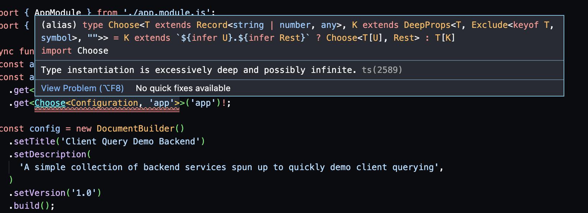

I was randomly scrolling Twitter and came across this—

Hmm, ¿son un tío o una mujer? No sé.

But anyway their name was trash, and yeah I mean "trash". Okay, I just did some digging on their profile and _his_ real name is
[Chris Bautista][chris-bautista], you can hear him say "I'm trash" like "I am Groot".

https://media.giphy.com/media/l4FGrYKtP0pBGpBAY/giphy.gif

Back to what I was saying—I don't know what it is with me and not keeping to topic. I just want to say so many things in so little
time, and it's killing me, argh!

Yeah, back to what I was saying, for real: @trashh_dev wrote this tweet about someone making [react i18n][react-i18n] type-safe. From the
moment I saw "made react i18n type safe", I was intrigued, like, "how did they do that?". I saw the code snippet following and I thought
to try it out. Brethren, lo and behold, it was legit.

https://twitter.com/trashh_dev/status/1558209179071877120?s=20&t=z8VEYzRjHBawfS8Awu5c2A

The code snippet was easy to understand, but I never knew TypeScript could infer string literals. I guess that was my [#TIL][til] for
the day.

So after seeing that, I thought about another use case. One that has always been common with me—accessing property types from a parent
type or interface.

```ts
interface User {
  name: string
  nick: string
  dateOfBirth: Date
  address: {
    city: string
    state: string
    country: string
    zip: string
  }
}
```

So given this `User` type, say I need just the `address` type, this is what I'll do in TypeScript.

```ts
const address: User['address'] = {
  city: 'Ikeja',
  state: 'Lagos',
  country: 'Nigeria',
  zip: '100001',
}
```

This is fine! But it starts looking not so fine when the type gets deeper.

```ts
interface User {
  name: string
  nick: string
  dateOfBirth: Date
  address: {
    city: string
    state: string
    country: string
    zip: string
    coords: {
      lat: number
      lng: number
    }
  }
}
```

Now, we only just need `coords` so let's pluck it:

```ts
const coordinates: User['address']['coords'] = { lat: 7.152627, lng: 3.657474 }
```

You may be thinking:

1. Why would anyone have to do this?
2. Why not just make an `Address` type and a `Coordinates` type?

Plus one for being a critical thinker.

Let's try to tinker since we've got a thinker amongst us:

```ts
interface Coordinates {
  lat: number
  lng: number
}

interface Address {
  city: string
  state: string
  country: string
  zip: string
  coords: Coordinates
}

interface User {
  name: string
  nick: string
  dateOfBirth: Date
  address: Address
}
```

And then we can do better:

```ts
const coordinates: Coordinates = { lat: 7.152627, lng: 3.657474 }

const address: Address = {
  city: 'Ikeja',
  state: 'Lagos',
  country: 'Nigeria',
  zip: '100001',
  coords: coordinates,
}
```

But trust me, not every value is made of a type—some types are made of a value—because you may never know the type till after the value
has been created (or composed). Thank goodness an example isn't far from us and I didn't even write it.

Take a look at the code snippet in the image tweeted by trash embedded above: the type of `Translations` isn't known until after the
value of `translations` has been composed. Some other times this same pattern may be adopted to avoid duplication. When the type and the
value would eventually end up being the same, then we can just infer the type from the value using a `typeof` (TypeScript) operator.

```ts
const translations = {
  translationOne: 'hello world',
  translationTwo: 'hello {{world}}',
  translationThree: "hello {{world}}, I'm {{name}}!",
  translationFour: '{{foo}} has a {{bar}}',
} as const

type Translations = typeof translations
```

The value of `translations` above isn't made of a type, whereas the type of `Translations` is made of a value.

Few reasons why this may be the case:

- To avoid duplication, types are inferred from object values using the (TypeScript) `typeof` operator.
- Sometimes the values are known before the types because it's the value that makes the type.
- Some libraries may not export all the types contained in a parent type (i.e these child types are kept private to the library and only
  just exist on their parent interface or type)

## How I plan to make this better

So just like lodash where you can access object properties using the [dot notation][lodash-dot-notation], we'll create a `Choose` type
that can help us choose the type of child properties from a parent type.

<Callout type="info">
  Unlike in lodash, accessing array or tuple types with bracket&#x2013;index notation is not
  accounted for.
</Callout>

```ts
export type Choose<
  T extends Record<string | number, any>,
  K extends string
> = K extends `${infer U}.${infer Rest}` ? Choose<T[U], Rest> : T[K]
```

This is just like a normal recursive function:

1. Infer the first string literal that appears before a dot as a type `U`.
2. Pack subsequent string literals appearing after a dot into a type `Rest`.
3. So long as type `K` has a dot within it, keep calling this type on type `T[U]` while passing `Rest` as the new type of `K`.
4. Otherwise, terminate at the point where `K` has no more dots and return the type `T[K]`

<Callout type="warn">
  Note that this would break if the object key(s) contains a dot which is our chosen delimiter.
</Callout>

```ts
const coordinates: Choose<User, 'address.coords'> = {
  lat: 7.152627,
  lng: 3.657474,
}

const address: Choose<User, 'address'> = {
  city: 'Ikeja',
  state: 'Lagos',
  country: 'Nigeria',
  zip: '100001',
  coords: coordinates,
}
```

The only shortcoming of this known to me is that we can't get static type inference on the second parameter of `Choose` which would be
the dot-notated keys of the type `T`, in this case, `User`.

There are ways to fix this, but not so reliant, because it's a recursive computation too, and type `T` can be just any type such that we
can't tell how deep it gets. TypeScript starts complaining after certain levels of recursive computing.

```ts
type Join<K extends string | number, P extends string | number> = `${K}.${P}`

export type DeepProps<
  T extends Record<string | number, any>,
  K extends Exclude<keyof T, symbol> = Exclude<keyof T, symbol>,
  U extends string | number = ''
> = T[K] extends Record<string | number, unknown>
  ?
      | (U extends '' ? K : U)
      | DeepProps<
          T[K],
          Exclude<keyof T[K], symbol>,
          U extends ''
            ? Join<K, Exclude<keyof T[K], symbol>>
            : U | Join<U, Exclude<keyof T[K], symbol>>
        >
  : U
```

If you want me to explain what's going on here, it may take me writing another post or maybe not. Not that it's difficult, but I currently
can't think of a way to explain it that'll be concise enough. All I can say is, if you care enough, copy it, break it and reconstruct the
logic bottom up, one step at a time, and see how the logic composes to achieve the desired result.

Alright, alright, I've heard you! Here you go:

1. We have a `Join<K, P>` type that concats two string literal types `K` and `P` delimiting them with a dot.
2. A `DeepProps<T>` type that enumerates all the paths in a type or an interface.
3. `DeepProps<T>` has internal args `K` and `U`, where `K` is the `keyof T` with `symbol` excluded and `U` is the eventually joined paths
   carried from one call of `DeepProps<T, K, U>` to another.
4. If `U` is currently `''`, i.e no paths have been joined, union `K` which is the `keyof` the current type `T` with a call to
   `DeepProps<T[K], keyof T[K], ...>`.
5. `U` is carried to the next call of `DeepProps` so it can be further union'd with each successive call till a base case is hit where only
   `U` is returned.

If you are familiar with recursive functions from normal day-to-day programming this will be easy to comprehend. All the patterns used are
similar to those used with recursive routines.

```ts
type Keys = DeepProps<{
  app: { game: { lame: number; blame: string; same: { came: string } } }
}>

// type Keys = "app" | "app.game" | "app.game.lame" | "app.game.blame" | "app.game.same"
```

Notice that `"app.game.same.came"` isn't present in the permutations. For whatever reason, it goes as deep as is common to all keys at a
certain level.

```ts
export type Choose<
  T extends Record<string | number, any>,
  K extends DeepProps<T>
> = K extends `${infer U}.${infer Rest}` ? Choose<T[U], Rest> : T[K]
```

Now, you get type inference on the second parameter `K` which is a permutation of the keys in object `T` strung together with a dot
wherever necessary

If you used this type on another object, TypeScript might choke on it, so it's just safe to not use it at all.



After all considerations, our eventual type is this:

```ts
export type Choose<
  T extends Record<string | number, any>,
  K extends string
> = K extends `${infer U}.${infer Rest}` ? Choose<T[U], Rest> : T[K]
```

and TypeScript won't choke along the way!

https://media.giphy.com/media/damYg6Mana2CHXfuz5/giphy.gif

## Update \[19th March, 2023\]: An elaborate `DeepProps` type

So I found a better type implementation that can get the correct permutation of all possible paths in an object without choking TypeScript.

I found these from [one of the libraries][nestjs-i18n-gh] I use in some projects. I took a look at the implementation and saw it was a very solid one they achieved by having to
use three other helper types.

One of these helper types checks if a type is `any`.

While it's important to know that:

- The types `unknown` and `never` don't intersect.
- The types `unknown` and `any` do intersect.
- Both `keyof never` and `keyof any` is `string | number | symbol`
- While `keyof unknown` is `never`.

These are all very similar types (`any`, `unknown` and `never`) that vary pretty much.

Here are some assumptions of mine on these three types that are quite alike:

- `any` means no discrimination and whatever type or any type can fit in.
- `unknown` may seem like `any`, which you may think of also as unknown, but the difference is, `any` is a valid type while `unknown` is not really a type; it's more like a
  placeholder that must be filled with a valid type to make anything useful of it, hence the `keyof unknown` is `never`.
- `never` seems more like a vacuum (or maybe more strictly, an abomination), an abomination of types, yet a valid type. The thing is, while `never` is a valid type, there's no
  single type that fits into it other than itself.

But how is it that the `keyof never` is `string | number | symbol`?

As I said `never` is a valid type, and for most of all valid types in TypeScript and values in JavaScript, (with the exclusion of `null`, `undefined` and `void`) they do have
keys that somehow extend `string | number | symbol`. Other than primitves, all types in JavaScript are `Object`s. But primitves also do have their object representation and the
key of all objects will either be a string, number or symbol.

```ts
export type IsAny<T> = unknown extends T ? ([keyof T] extends [never] ? false : true) : false
```

For the second helper type of the three, this is where most of the trick is done. Here is the implementation of it in the source library.

```ts
type PathImpl<T, Key extends keyof T> = Key extends string
  ? IsAny<T[Key]> extends true
    ? never
    : T[Key] extends Record<string, any>
    ?
        | `${Key}.${PathImpl<T[Key], Exclude<keyof T[Key], keyof any[]>> & string}`
        | `${Key}.${Exclude<keyof T[Key], keyof any[]> & string}`
    : never
  : never
```

Notice the line that has `T[Key] extends Record<string, any>`.

It is important to know that arrays also pass the check as they are equally valid objects. So there's a problem.
We could inadvertently inlcude array properties like `length`, `find`, `map`, etc, in our paths, which I'm sure would be undesired. To avoid this, their implementation
excludes array keys from the keys of `T`. But there's a limitation there: any non-arraylike `T` that has one or more array properties in it's keys will have those excluded in
the eventual path.

Here is a modification to I made to fix that limitation. We add an extra helper type, which if you are counting, now makes it four.

```ts
type ExcludeArrayKeys<T> = T extends ArrayLike<any> ? Exclude<keyof T, keyof any[]> : keyof T
```

This is the same idea with:

```ts
// T extends Record<...>
if (typeof value === 'object') {
  // T extends ArrayLike<...>
  if (Array.isArray(value)) {
    // do something else
    return
  }
  // do something
}
```

So if we infuse that one line of helper type, we'd overcome the said limitation.

```ts
type PathImpl<T, Key extends keyof T> = Key extends string
  ? IsAny<T[Key]> extends true
    ? never
    : T[Key] extends Record<string, any>
    ?
        | `${Key}.${PathImpl<T[Key], ExcludeArrayKeys<T[Key]>> & string}`
        | `${Key}.${ExcludeArrayKeys<T[Key]> & string}`
    : never
  : never
```

The last helper is plain and simple and can even be avoided if it's inlined with the main type, but it makes it easily readable, I guess.

This just makes sure the [terminal][tree-terms-wikipedia] paths at the root of the object are inlcuded with the other non-terminal paths at the root.

```ts
type PathImpl2<T> = PathImpl<T, keyof T> | keyof T
```

And a type is born!

```ts
export type Path<T> = keyof T extends string
  ? PathImpl2<T> extends infer P
    ? P extends string | keyof T
      ? P
      : keyof T
    : keyof T
  : never
```

You are free to choose, no strings attached!

```ts
export type Choose<
  T extends Record<string | number, any>,
  K extends Path<T>
> = K extends `${infer U}.${infer Rest}`
  ? Rest extends Path<T[U]>
    ? Choose<T[U], Rest>
    : never
  : T[K]
```

[chris-bautista]: https://twitter.com/trashh_dev?s=20&t=z8VEYzRjHBawfS8Awu5c2A
[lodash-dot-notation]: https://lodash.com/docs/#get
[nestjs-i18n-gh]: https://github.com/toonvanstrijp/nestjs-i18n/blob/1a86bb46e9386c6450d10c9c9e609f78315752d0/src/types.ts#L27
[react-i18n]: https://react.i18next.com/
[tree-terms-wikipedia]: https://en.wikipedia.org/wiki/Tree_(data_structure)#Terminology
[til]: https://dictionary.cambridge.org/us/dictionary/english/til
