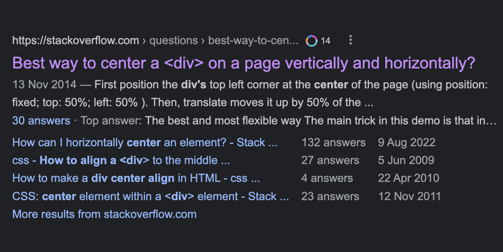

Hello once again friends and foes! I wasn't told I'll be writing to you again this soon. It was in such short notice, but I
guess it is what it is.
I'm probably just bored and looking for someone to talk to, my friends are welcome, but I don't mind my foes too as long as they
listen and not interrupt me.

<Blockquote data-cite="Caleb Adepitan">
  I've been there before, you've been there before, we've all been there before,
  so much so that it almost now feels like deja vu. Who knows, we might even
  find ourself there tomorrow again. You'll know when it's purple and not blue!
</Blockquote>

So there's been this phenomenon and you gotta believe me, it's not even a new thing, beacuse it only just came into existence
long after Isaac died. But I just thought to give it a name, and I coined it "purple link effect".

So what's the purple link effect, really?

I'm sure you've once before, or even more often than you can remember, been in that situation when you hit Google and search a
thing only for you to find out you've been in that same situation some time in the past, and it almost feels like deja vu, or
maybe not.

But how do you remember so easily that you've been there before when the reason why you are right back is because you've
forgotten. That's the purple link effect. The shadow of guilt that torments your conscience and criticizes you for being so
forgetful.

Don't let it bother you. I mean, it's just your browser and Google messing with you. Google just hacked your computer using HTML
and CSS. They instructed your browser to keep tabs on you. Now for every link you clicked in the past, if you see them again
anytime soon, they are purple rather than blue, just to indicate to you that this page has been visited some time in the past

Yeah, that link in particular or other variants of it, for a long time, was _every_ developers nightmare, they've always been
there before, and they never stop finding themselves back there. [Happy Death Day][happy-death-day] fellas!

Some think it's wrong for an experienced engineer to even search Google, even worse, be caught finding answers on Stack Overflow. Now, how wrong would it be when so called "experienced engineers" are caught up in the purple link effect, even after giving them so much leniency to let them use google—what a shame, such forgetful, experienced engineers.

Need I remind you, there's no need to feel guilty or beat yourself up about being forgetful. I know experienced engineers don't need to even hear this, but for the sake of those who are just getting the journey started, and looking onto others that have gone before them, trying to model their ways after them. Don't pressure yourself. The goal is not to be an engineer that knows it all, an engineer that doesn't use Google or an engineer that never consults other engineers (that's basically what we do on Stack Overflow). The goal is to be an engineer that can ask the right questions, reason in the right frame of mind, identify problems and way out, conribute and share knowledge, and most of it all solve problems using the tested and proven knowledge they've garnered from all about. And all that my friend, my foe, is what makes an experienced engineer. Not the delusional, egotistical, ignorant and make-believe portrait these other people out there try to paint of what an engineer should be.

It doesn't always have to be blue, it okay to see purple, it's okay to ask people, just know your ropes and how not to hang by it. Like Diana knows her lasso!

Disclaimer: Google didn't hack anyone with HTML and CSS, that was me messing around. They do keep tabs on you, but purple or visited links are something else, not spying.

"it's not even a new thing, beacuse it only just came into existence
long after Isaac died"—that was a weak one trying to make a pun with "new thing" and "Sir Isaac Newton", forgive me.

[happy-death-day]: https://en.wikipedia.org/wiki/Happy_Death_Day#:~:text=It%20follows%20a%20college%20student,killer%20and%20stop%20her%20death.&text=Originally%20announced%20in%202007%20under,%2C%202017%2C%20by%20Universal%20Pictures.
